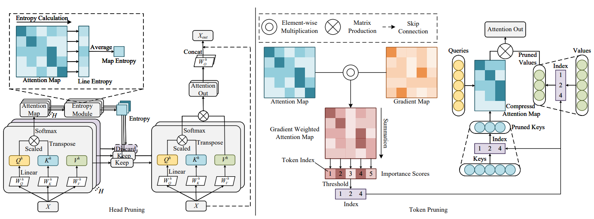

# Attention Map Guided Transformer Pruning for Occluded Person Re-Identification on Edge Device

The *official* repository for  [Attention Map Guided Transformer Pruning for Occluded Person Re-Identification on Edge Device](https://ieeexplore.ieee.org/abstract/document/10094027).

Our pruning work are based on the [TransReid](https://github.com/damo-cv/TransReID)

## Pipeline



## Requirements

### Installation

```bash
pip install -r requirements.txt
(we use /torch 1.6.0 /torchvision 0.7.0 /timm 0.3.2 /cuda 10.1 / 16G or 32G V100 for training and evaluation.
Note that we use torch.cuda.amp to accelerate speed of training which requires pytorch >=1.6)
```

### Prepare Datasets

```bash
mkdir data
```

Download the person datasets [Market-1501](https://drive.google.com/file/d/0B8-rUzbwVRk0c054eEozWG9COHM/view) and [Occluded-Duke](https://github.com/lightas/Occluded-DukeMTMC-Dataset)
Then unzip them and rename them under the directory like

```
data
├── market1501
│ └── images ..
├── Occluded_Duke
│ └── images ..
```

### Prepare Pre-trained Models

You can refer to the [TransReID](https://github.com/damo-cv/TransReID) repository to download or train the pre-trained models.

## Pruning 
We offer the config file for setting the pruning parameters, you can adjust the offered .yml file for pruning your own model

**Some examples:**
```bash
# token pruning for TransReid base Market-1501 
python finetune.py --config_file configs/Market/vit_transreid_stride_attn.yml
# head pruning for TransReid base Market-1501 
python finetune.py --config_file configs/Market/vit_transreid_stride_head.yml
```

## Evaluation

```bash
python test.py --config_file 'choose which config to test' MODEL.DEVICE_ID "('your device id')" TEST.WEIGHT "('your path of trained checkpoints')"
```

**Some examples:**

```bash
# OCC_Duke
python test.py --config_file configs/OCC_Duke/vit_transreid_base_attn.yml MODEL.DEVICE_ID "('0')" TEST.WEIGHT './logs/occ_duke_transreid_base_head25_attn25/best.pth'
# Market
python test.py --config_file configs/Market/vit_transreid_stride_attn.yml MODEL.DEVICE_ID "('0')"  TEST.WEIGHT './logs/market_vit_stride_base_attn25_head25/best.pth'
```

## Pruned Models (Size 256)


| Name |Dataset| mAP | R1 | Flops (G) | url |
| --- | --- | --- |--- | --- | --- |
| TR-AMG-Base-Head25-Token25 |Market-1501 |88.4 | 94.8 | 13.6 | [model](https://drive.google.com/file/d/1fdbMLlqd_fKxn1h2fDWvFX_VKKxA-mYO/view?usp=sharing) |
| TR-AMG-Base-Head25-Token25 | Occlude-Duke | 59.6 | 68.1 |15.3| [model](https://drive.google.com/file/d/1oEjFe9egQg9ToRJxWo-6cO0-PnQkgBvu/view?usp=sharing) |
| TR-AMG-Small-Head40-Token40 |Occlude-Duke |50.2 | 61.9 | 6.8 | [model](https://drive.google.com/file/d/1tDnArM9PT7SDudrndu-udiKTnEUJNv2x/view?usp=sharing) |

Note: We reorganize code and the performances are slightly different from the paper's.

## Acknowledgement

Codebase from [TransReid](https://github.com/damo-cv/TransReID) , [pytorch-image-models](https://github.com/rwightman/pytorch-image-models)


